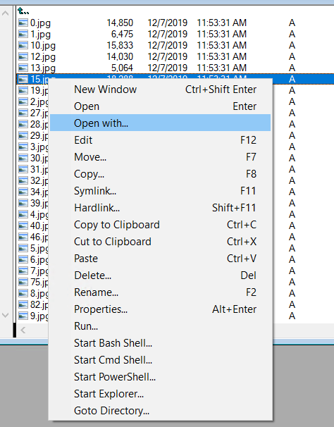

#  Windows File Manager (WinFile)

## Modification

I really like WinFile, so I decided to use it on a daily basis because it allows me to do many things much faster and more conveniently than the default file explorer in Windows. Unfortunately, it didn't have the 'Open with' option in the context menu, so I added it.

## History

The Windows File manager was originally released with Windows 3.0 in the early 1990s. You
can read more about the history at https://en.wikipedia.org/wiki/Windows_File_Manager .

## Change history

Highlights of changes in each release are in [CHANGES.md](CHANGES.md).

## What it looks like

# 

## Development

If you want to make modifications and add new features, I recommend using the original [project](https://github.com/microsoft/winfile) for this purpose.

## License

Copyright (c) Microsoft Corporation. All rights reserved.

Licensed under the [MIT](LICENSE) License.
